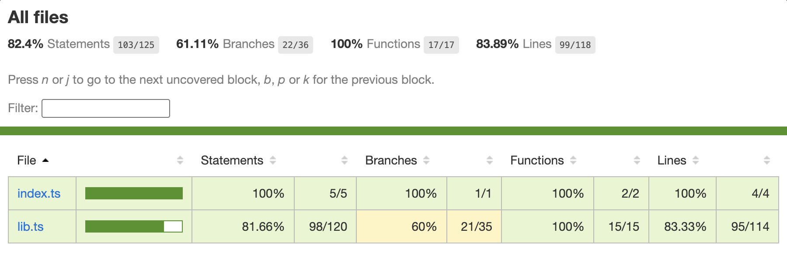

# fresh-onion

## What is this?

`fresh-onion` is a small library that enforces referential integrity in your codebase by validating that each module only imports from allowed layers — based on a clearly defined architecture.

It’s especially useful in monorepos and monolithic applications that follow the Onion Architecture, also known as Clean Architecture.

## Why do I need it?

In platforms like .NET, this architectural pattern is often implemented by separating each layer into its own project. After compilation, each project becomes a DLL, and references between layers must be explicitly added. This manual step naturally reduces the risk of breaking architectural boundaries.

In contrast, with Node.js and TypeScript, there’s no native mechanism to prevent one layer from importing another. Any developer can accidentally import code from a forbidden layer, and the project will still compile and run. This makes it far easier to violate architectural rules — often without realizing it.

Breaking layer boundaries is one of the most damaging things you can do to a Clean Architecture. It erodes the separation of concerns, increases coupling, and makes your codebase harder to maintain over time.

`fresh-onion` solves that problem by analyzing your codebase and ensuring every import respects the rules you’ve defined between layers — preserving the integrity of your architecture.

## How does it work?

`fresh-onion` uses TypeScript’s built-in compiler API to parse your codebase and analyze the imports between modules. It then compares these imports against the rules you’ve defined in a configuration file.

If it finds any violations, it will report them to you, along with the exact file where the violation occurred.

## How can I use it?

### 1 Create a `onion.config.json` file:

```json
{
  "layers": {
    "domain-model": "./src/domain-model",
    "domain-services": "./src/domain-services",
    "app-services": "./src/app-services",
    "infrastructure": "./src/infrastructure"
  },
  "rules": [
    {
      "from": "domain-model",
      "allowedImports": []
    },
    {
      "from": "domain-services",
      "allowedImports": ["domain-model"]
    },
    {
      "from": "app-services",
      "allowedImports": ["domain-model", "domain-services"]
    },
    {
      "from": "infrastructure",
      "allowedImports": [
        "domain-model",
        "domain-services",
        "app-services"
      ]
    }
  ]
}
```

The `layers` object defines the directory path for each layer in your project. The `rules` array defines the allowed imports for each layer.

### 2. Run the `fresh-onion` command:

```sh
npx fresh-onion
```

If there are issues you will see something like the following in the console:

```sh
Using config /api/onion.config.json
❌ "app-services" is importing from "infrastructure" via "/api/src/infrastructure/auth/jwt.ts"
❌ "app-services" is importing from "infrastructure" via "/api/src/infrastructure/logging.ts"
👎 Rotten 🧅 detected
```

If everything is fine you will see:

```sh
Using config /api/onion.config.json
👍 Fresh 🧅 detected
```

## More about the onion architecture

In the `onion.config.json` example above, we have four layers: `domain-model`, `domain-services`, `app-services`, and `infrastructure`. Each layer is defined by a directory path relative to the root of your project.

The configuration above enforces the onion architecture. The onion architecture takes its name from its representation as concentric circles:


In the onion architecture, the innermost circle represents the domain model, which contains the core business logic of your application. The next circle represents domain services, which contain the use cases that operate on the domain model. The outermost circle represents application services, which contain the application-specific logic that coordinates the domain services. Finally, the infrastructure layer contains the implementation details, such as database access, logging, and external services.

The onion architecture enforces a strict dependency rule: 

**Code in an inner circle can depend on code in an outer circle, but not vice versa**. 

This rule ensures that the core business logic remains isolated from the implementation details, making the codebase easier to maintain and test.


The configuration file above enforces this rule by specifying the allowed imports for each layer. For example, the `domain-services` layer is allowed to import from the `domain-model` layer, but not from the `app-services` or `infrastructure` layers.

You can use fresh-onion to enforce the boundaries between layers and ensure that your codebase adheres to the onion architecture or any other layered architecture you choose.

You can learn more about the onion architecture [here](https://dev.to/remojansen/implementing-the-onion-architecture-in-nodejs-with-typescript-and-inversifyjs-10ad).

## Contributions

Contributions are welcome! If you have any ideas, suggestions, or bug reports, please open an issue or submit a pull request.

1. Clone the repository from GitHub.

2. Access the project directory with `cd fresh-onion`.

3. Install the dependencies with `npm install`.

4. Run the tests with `npm test`. 

5. Run `npm run coverage` to generate a coverage report.


